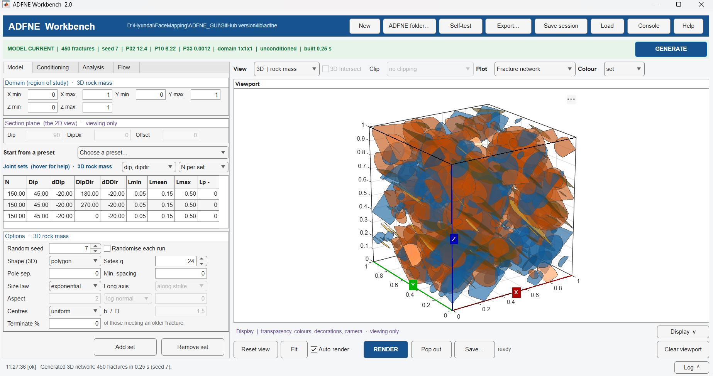
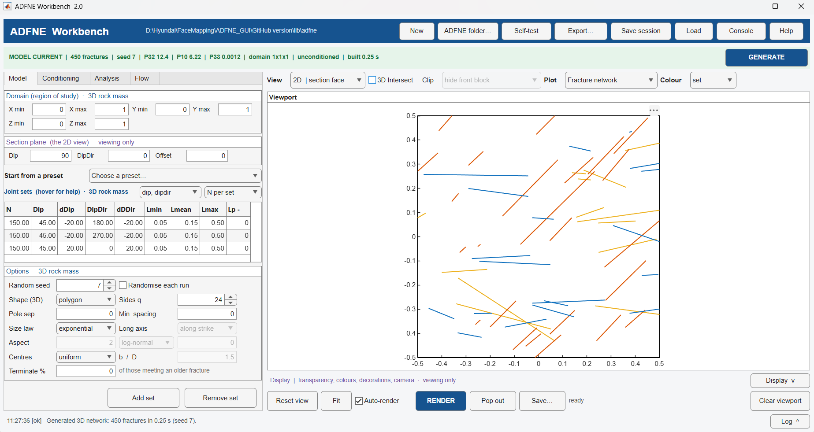
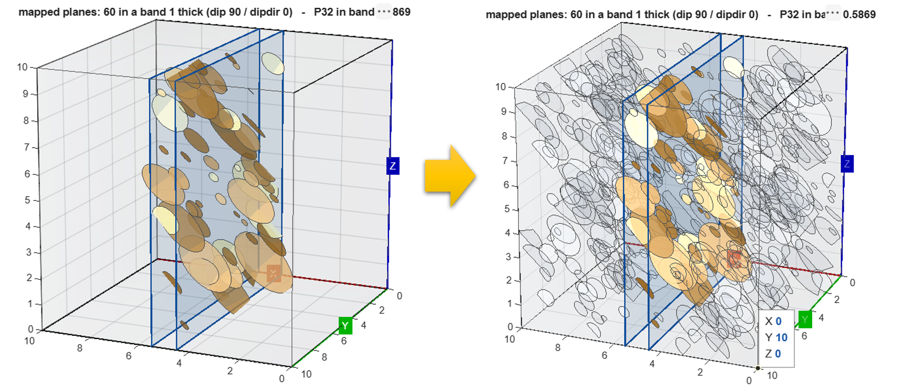
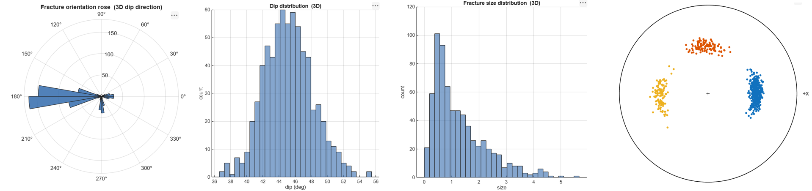
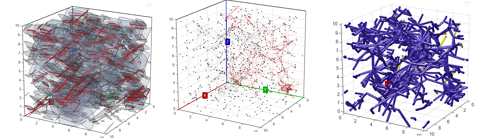
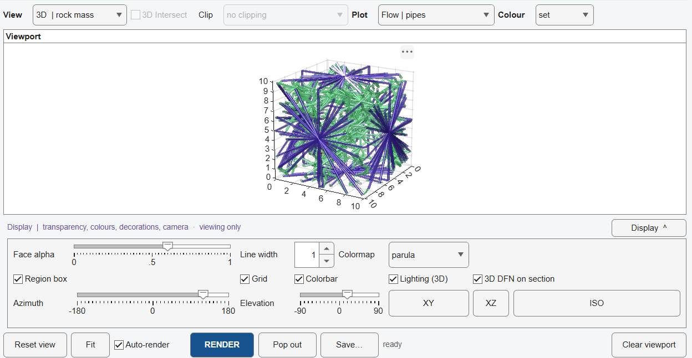

# ADFNE Workbench

A graphical front end for **ADFNE** (Alghalandis Discrete Fracture Network
Engineering), built as a single-file MATLAB `uifigure` app for generating,
conditioning, analysing, and flow-testing discrete fracture networks (DFNs).

It lives **outside** the ADFNE source tree and never modifies it — the merged library
in `lib/adfne/` is vendored so the app is self-contained; copy or move this folder
anywhere and it still runs.

> **License note.** This GUI is free for noncommercial use (research, teaching,
> evaluation) — see [LICENSE](LICENSE). It wraps ADFNE, which has its own citation
> requirement — see [THIRD_PARTY_LICENSES.md](THIRD_PARTY_LICENSES.md). Commercial use
> of either requires separate permission.

## What it does

One 3D rock mass, always. Four tabs ask four questions about it:

| Tab | Question |
|---|---|
| **Model** | What is it? Domain, joint sets, orientation model, size law, centre placement, termination, shape. |
| **Conditioning** | What did the mapped face say? Import trace maps or 3D joint planes, fit set parameters to them, or condition the model to reproduce them exactly. |
| **Analysis** | What can be measured on it? Clusters, intersections, backbone, connectivity fields, intensity (P10/P21/P32), orientation and size statistics, borehole sampling. |
| **Flow** | Does it flow? Steady-state pipe-network flow solver with percolation check and mass-balance residual. |

Everything about the *picture* — view, plot type, colour, styling, camera — sits with
the viewport instead of on its own tab, and every plot is rendered through ADFNE's own
drawing code, so what you see matches what ADFNE produces at the command line.

### Generation

- Joint-set orientation models: `dip, dipdir` (ADFNE's own), **Fisher**, **Kent**,
  **Bingham**, bivariate normal, or bootstrap from mapped 3D planes.
- Size laws: exponential, log-normal, power law, uniform, normal, Weibull, gamma, or
  bootstrap — each fittable from mapped data.
- Centre placement: uniform (Baecher), Nearest-Neighbour clustering, or Lévy–Lee
  fractal walks.
- **Enhanced Baecher termination** — younger fractures abut older ones, in table order,
  changing network connectivity the way real joint sets do.
- Fracture shape: regular or elongated polygons with a configurable aspect-ratio law
  and long-axis direction.
- Conditional simulation: minimum pole separation and minimum centre spacing, imposed
  in 3D rather than only on a 2D cut.

### Conditioning and fitting

- Import a 2D trace map from a mapped exposure, or 3D joint planes from a scan or
  photogrammetry plane-fit.
- **FIT** infers 3D joint-set parameters from the field data by simulated sampling
  (generate → sample → rescale), with a documented recovery test and stated limits —
  including the orientation degeneracies a single face cannot resolve.
- **Condition** the model so every mapped fracture appears exactly as mapped, with a
  stochastic background generated around it.
- Corrects for the sampling biases scanning and mapping introduce: size bias, chord
  bias, band censoring at scan faces, and length-biased sampling in a band — each
  against a documented analytic or simulated check.
- **Compare 2D Trace Maps** / **Compare 3D Joint Planes** score a fit or a conditioning
  on orientation (Kuiper), trace length (Kolmogorov–Smirnov), topology (I/Y/X nodes),
  and count, over the window actually mapped.

### Flow

Steady-state flow through the fracture network via ADFNE 1.5's pipe-graph solver
(`Pipe → Backbone → Graph → Solve`), with percolation testing, mass-balance residual,
and effective conductivity.

## Screenshots

**3D rock mass, freshly generated**


**The same model, viewed as a 2D section face**


**Conditioning — fitting and reproducing mapped field data**


**Analysis — clusters, intersections, connectivity, intensity**


**Flow — steady-state pipe-network solver**


**The Display dock — styling without covering the picture**


## Running it

```matlab
cd path\to\ADFNE_GUI
ADFNE_GUI
```

`ADFNE_GUI` sets up its own paths, finds its library in `lib\adfne`, and opens the
window. It never looks outside its own folder. To point at a different ADFNE copy:

```matlab
ADFNE_GUI('C:\path\to\ADFNE')
```

The **Help** button (or `ADFNE_GUI('help')`) opens a second copy of the window in help
mode: click any control to read what it does, without touching your model.

To verify the library layer is intact: `ADFNE_GUI.smoketest`.

## Repository layout

```
ADFNE_GUI\
|-- ADFNE_GUI.m          <- the entire app, one file
|-- LICENSE              <- this repo's license (GUI) + pointer to ADFNE's (library)
|-- THIRD_PARTY_LICENSES.md
|-- lib\
|   |-- adfne\           <- merged ADFNE 1.0 + 1.5 library (vendored, read-only)
|   `-- deps\            <- third-party helpers ADFNE needs but does not ship
|-- docs\                <- ADFNE licenses, dependency licenses, screenshots
`-- examples\             <- sample trace maps and joint-plane files to try import/fit
```

## Citation

This GUI wraps ADFNE and does not replace citing it. If you use this software, please
cite:

> Fadakar-A Y (2017) *ADFNE: Open Source Software for Discrete Fracture Network
> Engineering, Two and Three Dimensional Applications*, Computers & Geosciences
> 102:1-11.

See [THIRD_PARTY_LICENSES.md](THIRD_PARTY_LICENSES.md) for the full citation
requirement and every third-party license in this repository.
