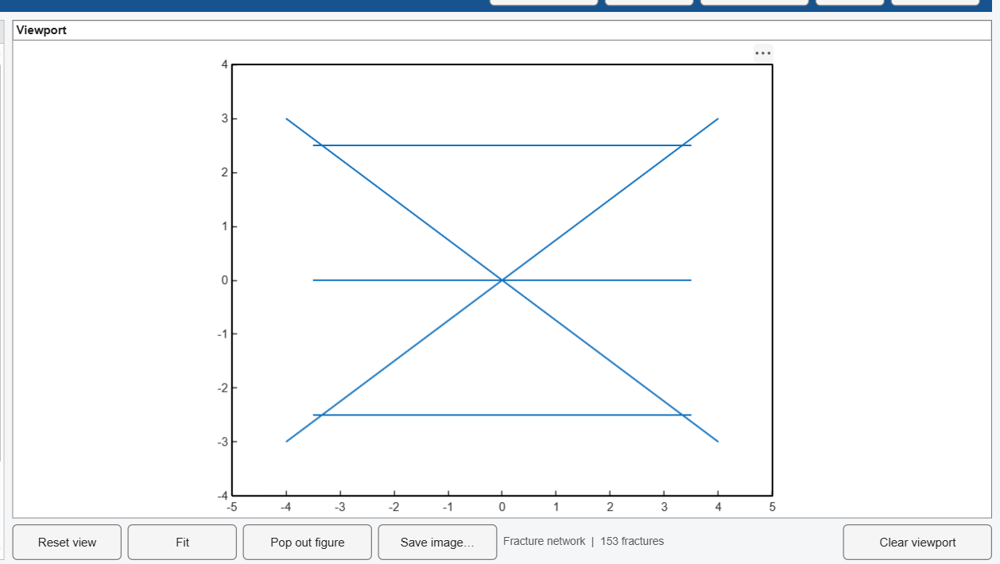

# Example trace maps

Synthetic mapped faces for trying **import**, **fit** and **conditioning** without
needing real field data.

## Set this up first

The coordinates in these files are **face coordinates** `(u, v)` — position on the
section plane, in domain units — so the model must be set up to match:

| Model tab | value |
|---|---|
| Domain | X `0 – 10`, Y `0 – 10`, Z `0 – 8` |
| Section plane | Dip `90`, DipDir `0`, Offset `0` |

That gives a vertical face 10 m wide by 8 m high, spanning `u = -5 … 5` and
`v = -4 … 4`. Every file's coordinates lie inside that.

Then on the **Conditioning** tab: Source = *imported trace file* → **Import file…**

## The format

Plain CSV, no header, one trace per row:

```
u1, v1, u2, v2 [, set]
```

`u1 v1` and `u2 v2` are the two endpoints of the trace on the face. The optional fifth
column assigns the trace to a joint set; without it, each trace is assigned to whichever
set best contains its direction.

## The files

| file | traces | what it is for |
|---|---|---|
| `01_simple_5_traces.csv` | 5 | a big X plus three horizontal lines — obvious enough to check by eye |
| `02_from_known_model.csv` | 54 | sectioned from a model whose true parameters are given below |
| `03_with_set_ids.csv` | 54 | the same face, with set ids in column 5 |
| `04_dense_face.csv` | 100 | a realistically busy face, three sets |
| `05_oversize_trace.csv` | 9 | contains a 12.2 m trace, longer than any set's `Lmax` |

## What to try



*What `01_simple_5_traces.csv` looks like when it has worked: the face spans u -5..5,
v -4..4, and shows exactly the five imported traces.*

**Does conditioning really honour the map?**
Import `01`, tick *Condition the model on this map*, press **GENERATE**. Switch the
Model tab's View to *2D section* and plot the fracture network. You should see exactly
the five traces you imported — the X and three horizontals — and nothing else on that
plane. Every file round-trips exactly: 5 in / 5 out, 54 / 54, 100 / 100.

**What does "mapped face is complete" do?**
Untick it and regenerate. Now stochastic fractures are allowed to cross the face too, so
the section shows your five traces *plus* others. Ticked is the honest setting when your
map is a complete record of that face.

**Can the fit recover parameters I already know?**
`02` was sectioned from this model:

| set | N | Dip | dDip | DipDir | dDipDir | Lmin | Lmean | Lmax |
|---|---|---|---|---|---|---|---|---|
| 1 | 220 | 78 | -30 | 145 | -30 | 0.5 | 1.5 | 4.0 |
| 2 | 160 | 62 | -25 | 250 | -25 | 0.4 | 1.2 | 3.0 |

Put deliberately wrong numbers in the Model tab — say half the count and twice the size
— import `02`, and press **FIT 3D SETS TO THESE TRACES**. Starting from N = 110/80 and
Lmean = 3.30/2.64, the fit returns:

```
                  true    start   fitted    error
set 1  N           220      110      272   +23.6%
       Lmean      1.50     3.30     1.45    -3.1%
set 2  N           160       80      198   +23.8%
       Lmean      1.20     2.64     1.16    -3.1%
```

It recovers the size to within a few per cent from a starting value 2.2x too large, and
the count to about 24%. It is **not exact**, and should not be believed to two
significant figures: 54 traces is a small sample. Size and count are also partially
confounded — many combinations give the same P21, and only the mean trace length
separates them — so their errors lean opposite ways, size slightly low and count high.

The summary panel reports what it matched:

```
measured over : 10 x 8  (100% of the face)
mean trace L    1.424    1.449      <- target, fitted
P21            0.9614   0.9601
spread over 5 realisations: mean L +/- 0.083, P21 +/- 0.152
```

That spread is the honest uncertainty: the P21 of a single realisation moves by +/-0.15
on its own, which is most of the count error above.

**What happens when a trace is too long for its set?**
Import `05`. (`01` does this too — its traces are 7-10 m, longer than any preset's Lmax,
so it logs the same message.) Its 12.2 m trace cannot be honoured by a set whose `Lmax` is 4 m, so the
size range is stretched for that one fracture and the log says how many were affected.
Real mapped faces do this whenever the set statistics do not match what was mapped.

**Does the section plane matter?**
Import any file, generate, then change the section **Offset** on the Model tab. The
conditioned fractures were built on the plane at offset 0, so moving away from it shows
the stochastic part of the model instead — the map is honoured on its own plane, not
everywhere.

## Making your own

These were generated by sectioning 3D models built in the app itself, then writing
`Model.sec.lines` to CSV. Any file with four numeric columns in face coordinates will
import.
